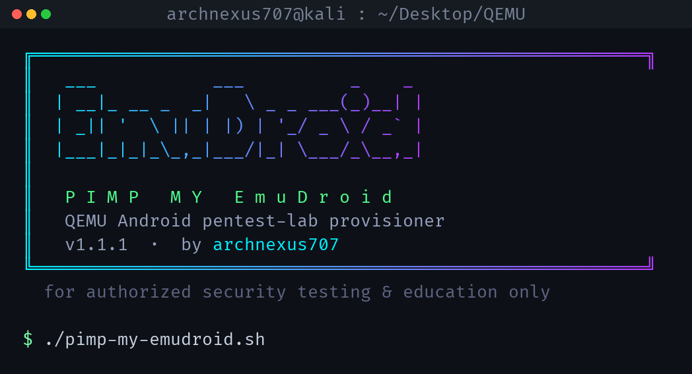
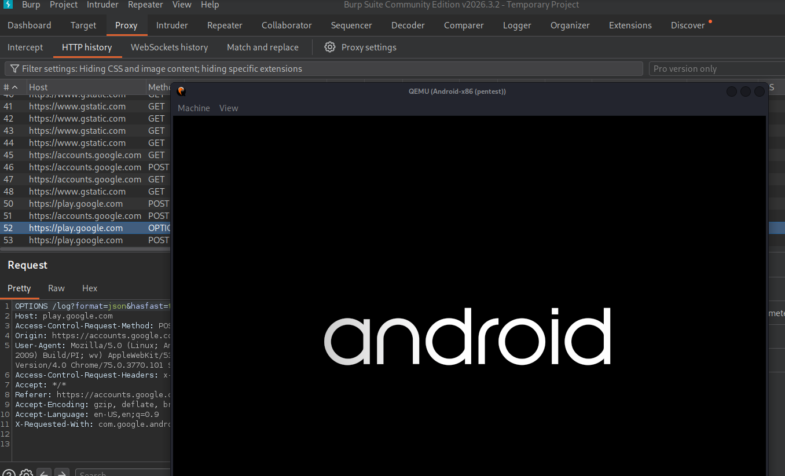

<p align="center">
  
</p>

<h1 align="center">Pimp My EmuDroid</h1>

<p align="center">
  <b>A single-file TUI that stands up a KVM-accelerated Android pentest lab in QEMU — Frida &amp; Burp ready.</b><br>
  <sub>by <a href="https://github.com/archnexus707">archnexus707</a> · for authorized security testing &amp; education only</sub>
</p>

<p align="center">
  
  
  
  
</p>

---

## What it does

`pimp-my-emudroid.sh` is **one self-contained Bash script** with a geeky terminal UI (figlet
banner, truecolor gradients, arrow-key menus, animated system scan). It provisions and wires up
the whole Android pentest lab for you:

- 🔍 **System scan + recommendation** — reads CPU / RAM / KVM / disk and picks the best-fitting
  Android image **and** VM RAM/CPU for your machine.
- 🩺 **Dependency Doctor** — checks qemu, adb, aapt, openssl, frida, jadx, apktool… and installs
  what's missing (apt + pipx), only with your consent.
- 📀 **Provision** — downloads an official Android-x86 ISO and builds a qcow2 disk.
- ⚡ **Unattended auto-installer** — drives Android-x86's `AUTO_INSTALL` boot path, zero manual menus.
- 🎯 **Frida setup** — installs frida-tools (16.x, script-compatible) + the exact version-matched
  `frida-server`, and drops in a universal SSL-unpinning script.
- 🔐 **Burp CA + proxy** — installs your Burp cert into a running VM's system store and sets the proxy.
- 🔬 **APK static analysis** — badging, signing, manifest risk flags, exported components,
  dangerous permissions, hardcoded-secret hunting. **100% local.**
- ❤️ **Health check**, 💾 **snapshot manager**, 🎨 **themes** (neon / matrix / synthwave),
  config persistence, cleanup.

## Lab in action

Android-x86 running in QEMU while Burp decrypts its HTTPS traffic:

<p align="center">
  
</p>

---

## Requirements

- Linux with **apt** (Kali / Debian / Ubuntu / Parrot)
- CPU virtualization (VT-x / AMD-V) + **KVM** for acceleration (works without — just slow)
- An interactive 256-color / truecolor terminal
- `sudo` (only used when you approve dependency installs)

Everything else the **Dependency Doctor** can install for you.

## Install

It's a single file — installation is copying it.

```bash
git clone https://github.com/archnexus707/PimpMyEmuDroid.git
cd PimpMyEmuDroid
chmod +x pimp-my-emudroid.sh
./pimp-my-emudroid.sh
```

Optional — install as the `emudroid` command:

```bash
sudo install -m 755 pimp-my-emudroid.sh /usr/local/bin/emudroid
emudroid
```

On first launch you get a **network & usage notice** listing exactly what it may download, then
run **🚀 Guided setup** — it walks scan → doctor → provision → install → frida end to end.

## Usage

```
./pimp-my-emudroid.sh            launch the interactive TUI
  --scan                         system scan + emulator recommendation
  --check                        dependency doctor (table only)
  --apk <file> [--deep]          static-analyze an APK (--deep adds jadx)
  --auto-install <ax9|ax81>      unattended Android-x86 install
  --banner                       print the banner
  --notice                       re-show the first-run notice
  --version | --help
```

Env overrides: `PME_LAB_DIR` (default `~/Desktop/QEMU`), `PME_THEME` (neon|matrix|synthwave),
`PME_DISK_SIZE` (e.g. `16G`).

### Generated helpers

When you provision an image, the tool writes these into your lab directory (you don't ship them):

| File | Purpose |
|---|---|
| `pme-install-.sh` | one-time manual installer (ISO + disk) |
| `pme-run-.sh`     | boot the installed VM; forwards `:5555` for adb |
| `pme-connect.sh`       | post-boot: adb connect, root, frida-server, port-forward, keep screen awake |

## What it downloads

Only packages and images, always after you confirm:

- **APT repos** — system deps via `apt` + `sudo`
- **sourceforge.net** — official Android-x86 ISOs
- **github.com/frida/frida** — version-matched `frida-server`
- **PyPI** (pipx) — `frida-tools`

Fully offline (never touch the network): system scan, recommendation, APK static analysis, and
installing the CA/proxy into your own VM. **No telemetry. No third-party app backends.**

---

## ⚠️ Legal & responsible use

Use only against devices and applications you are **authorized** to test — your own apps, or
targets inside a bug-bounty / pentest scope that permits it. Static analysis of an APK you legally
possess is local research; intercepting a third party's live traffic or probing their backend
requires authorization. **This tool ships no exploits and targets no one.** You are responsible
for how you use it.

## License

MIT © [archnexus707](https://github.com/archnexus707)
